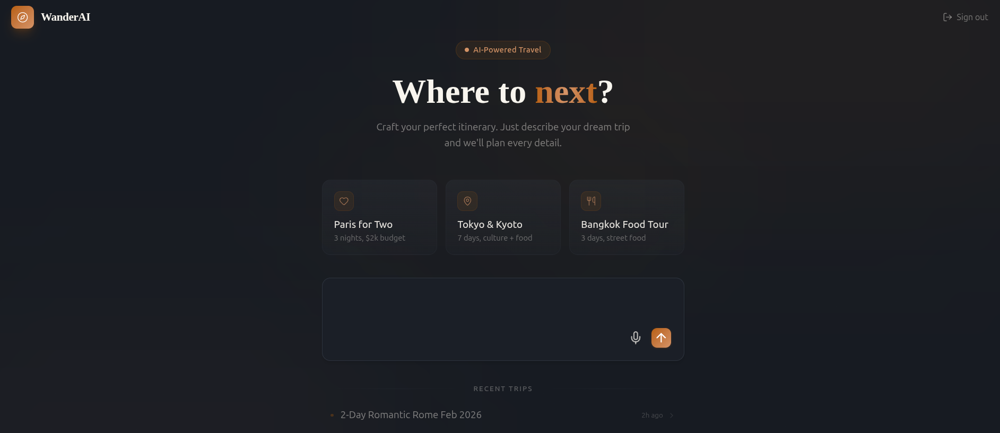

# WanderAI



A conversational AI trip planner that generates rich, interactive travel itineraries through natural conversation.

Built for the **Tambo AI — The UI Strikes Back** hackathon.

## Features

- **Conversational Planning** — Describe your ideal trip in natural language and watch it come to life
- **Generative UI** — AI dynamically renders trip overviews, day itineraries, place cards, and budget breakdowns
- **Interactive Components** — Modify your trip on the fly with interactable UI elements
- **Context Awareness** — AI remembers your trip details throughout the conversation
- **Smart Suggestions** — Contextual follow-up prompts to refine your trip

## Tech Stack

- **Framework**: Next.js 15, React 19
- **AI SDK**: [Tambo AI](https://tambo.co) for generative UI
- **Styling**: Tailwind CSS with custom WanderAI theme
- **Language**: TypeScript

## Getting Started

### Prerequisites

- Node.js 18+
- Tambo API key ([get one free](https://tambo.co/dashboard))

### Installation

```bash
# Clone the repo
git clone https://github.com/Allen-Saji/wander-ai.git
cd wander-ai

# Install dependencies
npm install

# Set up environment
cp example.env.local .env.local
# Add your NEXT_PUBLIC_TAMBO_API_KEY to .env.local

# Run dev server
npm run dev
```

Open [http://localhost:3000](http://localhost:3000) and start planning your trip!

### Scripts

| Command        | Description              |
| -------------- | ------------------------ |
| `npm run dev`  | Start Next.js dev server |
| `npm run build`| Production build         |

## Components

### Generative (AI-rendered)

| Component         | Description                                             |
| ----------------- | ------------------------------------------------------- |
| `TripOverview`    | Trip summary with destination, dates, stats, highlights |
| `DayItinerary`    | Day-by-day schedule with activities                     |
| `PlaceCard`       | Attraction/restaurant cards with details                |
| `BudgetBreakdown` | Cost breakdown with visual charts                       |
| `WeatherForecast` | Weather predictions for trip dates                      |

### Interactable (User-modifiable)

Components wrapped with `withInteractable` can be modified through conversation:

- Adjust budgets, add/remove activities, change dates, etc.

## Services

| Service               | Description                                 |
| --------------------- | ------------------------------------------- |
| `weather.ts`          | Weather forecast data for trip destinations |
| `travel-time.ts`      | Estimated travel times between locations    |
| `population-stats.ts` | City population and tourism statistics      |

## Example Prompts

- "Plan a 5-day trip to Tokyo for 2 people with a $3000 budget"
- "I want to explore temples and try local food in Kyoto"
- "Show me the best restaurants in Bangkok"
- "Add a day trip to Mount Fuji"
- "What's the weather like in Paris next week?"

## Architecture

```
┌─────────────┐     ┌─────────────┐     ┌─────────────┐
│   ChatPanel │────▶│  Tambo AI   │────▶│  TripPanel  │
│   (Input)   │     │   (LLM)     │     │  (Output)   │
└─────────────┘     └─────────────┘     └─────────────┘
```

## Future Scope

- **MCP Integration** — Connect external data sources via the Model Context Protocol to fetch real-time hotel availability, restaurant listings, flight schedules, and booking details directly within the conversation
- **Hotel & Accommodation Search** — Browse and compare hotels, hostels, and vacation rentals with pricing, ratings, and availability
- **Flight Search & Booking** — Find flights between destinations with fare comparisons and direct booking links
- **Restaurant Discovery** — Surface nearby restaurants with menus, reviews, and reservation options
- **Activity & Tour Booking** — Search and book guided tours, experiences, and attraction tickets
- **Multi-city Route Optimization** — Suggest optimal travel routes across multiple destinations based on cost and travel time
- **Collaborative Trip Planning** — Share trip plans with travel companions and edit together in real time

## License

MIT

---

Built with [Tambo AI](https://tambo.co)
